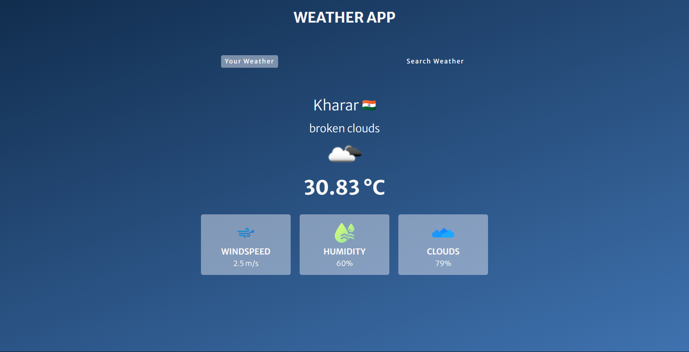
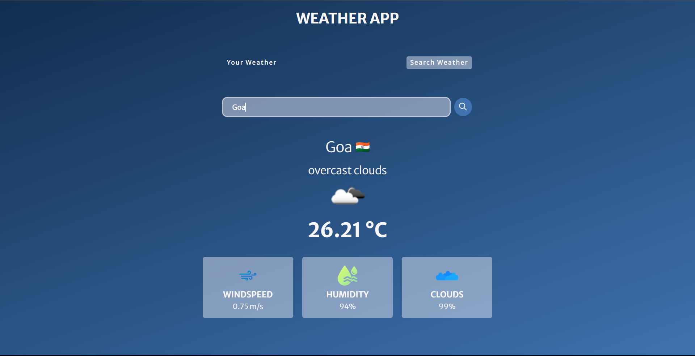

# Weather App

The Weather App is a web-based application that allows users to access weather information for their current location or any other location they specify. This project serves as a practical example of working with APIs, JavaScript, HTML, and CSS. The app provides detailed weather data, including weather type, temperature, wind speed, humidity, and cloud percentages.






## Table of Contents

- [Overview](#overview)
- [Installation](#installation)
- [Usage](#usage)
- [Features](#features)
- [Technologies Used](#technologies-used)
- [Contributing](#contributing)
- [License](#license)

## Overview

The Weather App offers users two main functionalities:

1. **Current Location Weather:** Users can grant access to their browser's location, and the app fetches weather data for their current location, providing real-time weather information.

2. **Custom Location Weather:** Users can enter the name of any location to retrieve its weather information, including weather type, temperature, wind speed, humidity, and cloud percentage.

The project is designed to enhance familiarity with JavaScript, APIs, and front-end development.

## Installation

1. Clone the repository:

   ```bash
   git clone https://github.com/sargunkohli152/Weather-App.git

2. Open project in your code editor and start application

## Usage
 - Current Location Weather:
    - Grant location access to the browser.
    - The app fetches and displays weather information for your current location.

 - Custom Location Weather:
    - Enter the name of a location.
    - Click the "Get Weather" button to fetch and display weather information for the 
      specified location.

## Technologies Used
 - HTML
 - CSS
 - JavaScript


## Contributing
Contributions are welcome! If you have any suggestions, improvements, or want to add new features to enhance the Weather App, please fork the project, make your changes, and submit a pull request.

## License
MIT License

Permission is hereby granted, free of charge, to any person obtaining a copy of this software and associated documentation files (the "Software"), to deal in the Software without restriction, including without limitation the rights to use, copy, modify, merge, publish, distribute, sublicense, and/or sell copies of the Software, and to permit persons to whom the Software is furnished to do so, subject to the following conditions:

The above copyright notice and this permission notice shall be included in all copies or substantial portions of the Software.

THE SOFTWARE IS PROVIDED "AS IS", WITHOUT WARRANTY OF ANY KIND, EXPRESS OR IMPLIED, INCLUDING BUT NOT LIMITED TO THE WARRANTIES OF MERCHANTABILITY, FITNESS FOR A PARTICULAR PURPOSE AND NONINFRINGEMENT. IN NO EVENT SHALL THE AUTHORS OR COPYRIGHT HOLDERS BE LIABLE FOR ANY CLAIM, DAMAGES OR OTHER LIABILITY, WHETHER IN AN ACTION OF CONTRACT, TORT OR OTHERWISE, ARISING FROM, OUT OF OR IN CONNECTION WITH THE SOFTWARE OR THE USE OR OTHER DEALINGS IN THE SOFTWARE.
